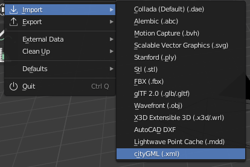
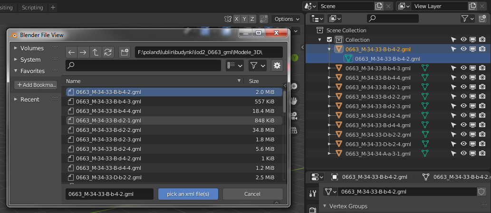
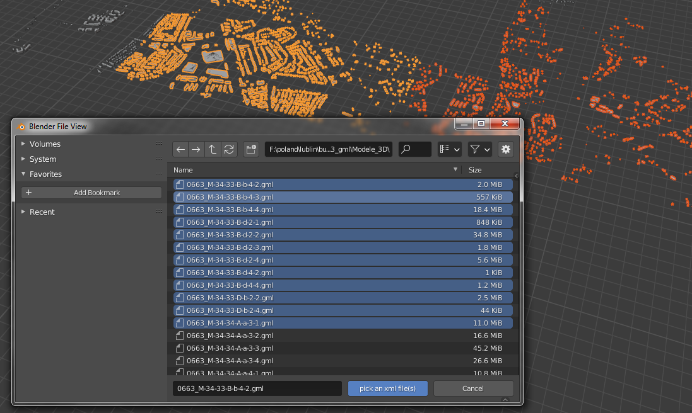
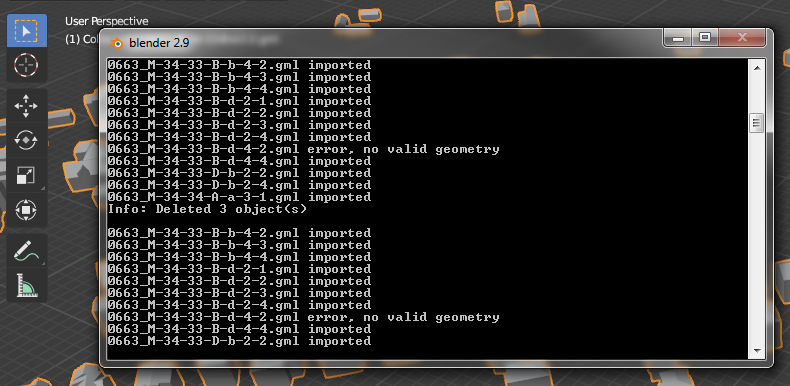
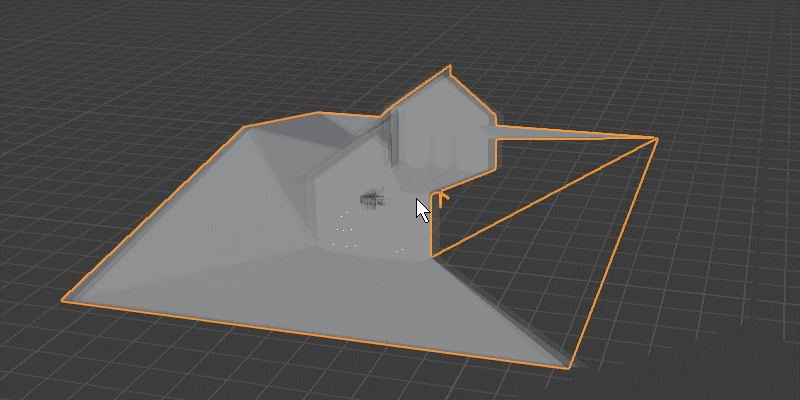
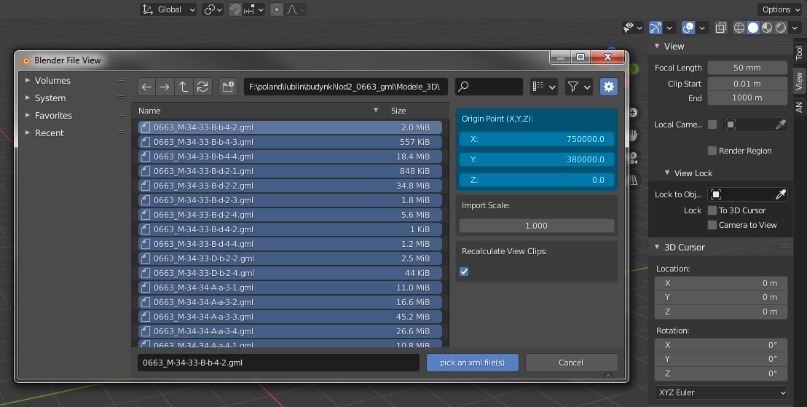
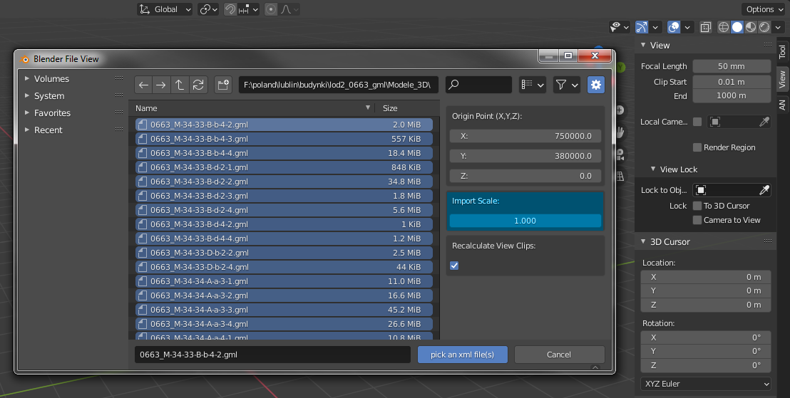
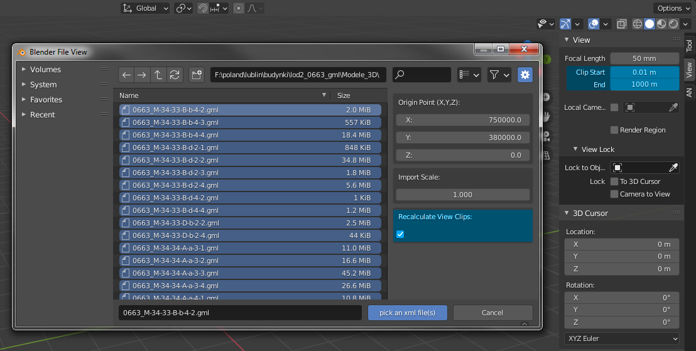
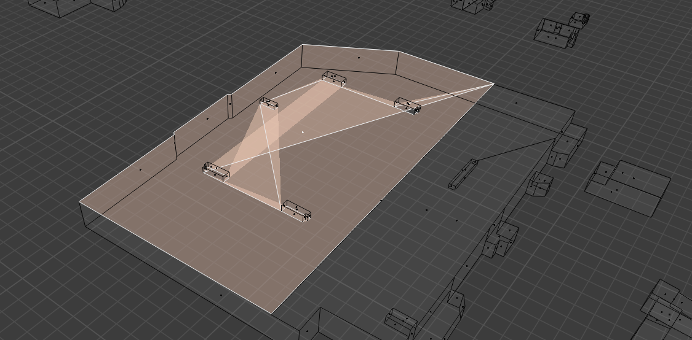

# Import CityGML

> Fork of [ppaawweeuu](https://github.com/ppaawweeuu/Import_CityGML)

This is a [Blender](https://www.blender.org/) addon to import geometry (only geometry) from 3d city models encoded in CityGML files.
It was started by Dealga McArdle ([zeffii](https://github.com/zeffii/)) in 2015 as [io_cityGML_basic](https://github.com/zeffii/io_cityGML_basic) addon for Blender 2.7, in 2020 was updated for 2.8 and 2.9.

There can be much non-geometrical information in CityGML files, for example materials, textures, building part classifications (wall, roof, floor, furniture), number of floors, roof type, addresses, occupancy and much more. Properties can be assigned to objects (building, road, tunnel) or parts (wall, roof), or geometry (solids, polygons, triangles). There is no limitation in the amount of information stored in CityGML file and there was no intention to import more than geometry.

## Basic Functionality

Addon imports geometry from CityGML file (or files) as one mesh/object (per file).

> basic means basic :)

Currently requires Blender 4.2.0. It may work on lower versions, but this has not been tested.

## Installation

1. Download repository as zip (through GitHub this can be done through the `Clone or download` > `Download ZIP` green button).

2. Run `Blender` and go to `Edit > Preferences > Add-ons` and press the down arrow on the top right. Afterwards press `Install from Disk...`

3. Select the downloaded ZIP and press `Install from Disk...`.

4. Enable the plugin from the list, by ticking the empty box next to the add-on's name. (Optional: If this is an update, un-tick and tick again the plugin to reload it!)

## Features

### Menu

Import menu item (import cityGML .xml)

### As One

Imports all geometry as one object

### Multi-file

Single or multiple file import (multiple files = multiple objects)

### Names

Imported file name = object & mesh name

### Options

Imported object are located in 0,0,0 (their origin) but mesh points can be for example x=12342222, y=23343322, z=23. City models can be huge. That is the reason why there are some problems in Blender with displaying geometry. It means problems with zooming, rotating, shadows, view clipping etc.

There are 3 workarounds:

1. Origin Point
   We can overwrite imported geometry origin point, to be closer to Blender World Origin (0,0,0).
   
   CityGML files should be readable in Notepad or most other text editors. We can find series of coordinates between `<gml:posList>` or `<gml:pos>` tags.

2. Import Scale
   We can scale all imported geometry to be closer to World Origin.
   

3. Recalculate View Clips
   When we work on big objects we need to change view clips. These options can recalculate those clips based on objects size.
   

### Other

Other features:

- Imports into current collection
- Imports `<gml:posList>` and lists of `<gml:pos>` tags
- Imports ground triangles (if any)
- Exception handling if file has no geometry & console progress info

## Testing Datasets

Addon was tested on files from Polish [geoportal.gov.pl](https://mapy.geoportal.gov.pl/)

Here are some direct links to CityGML files for 3 cities:

- [Warszawa - Map link](https://mapy.geoportal.gov.pl/imap/Imgp_2.html?locale=pl&gui=new&sessionID=5214135) / [Warszawa CityGML LoD1](https://integracja.gugik.gov.pl/Budynki3D/pobierz.php?d=2&plik=powiaty/lod1/1465_gml.zip) / [Warszawa CityGML LoD2](https://integracja.gugik.gov.pl/Budynki3D/pobierz.php?d=2&plik=powiaty/1465_gml.zip)
- [Lublin - Map link](https://mapy.geoportal.gov.pl/imap/Imgp_2.html?locale=pl&gui=new&sessionID=5214138) / [Lublin CityGML LoD1](https://integracja.gugik.gov.pl/Budynki3D/pobierz.php?d=2&plik=powiaty/lod1/0663_gml.zip) / [Lublin CityGML LoD2](https://integracja.gugik.gov.pl/Budynki3D/pobierz.php?d=2&plik=powiaty/0663_gml.zip)
- [Kraków - Map link](https://mapy.geoportal.gov.pl/imap/Imgp_2.html?locale=pl&gui=new&sessionID=5214142) /
  [Kraków CityGML LoD1](https://integracja.gugik.gov.pl/Budynki3D/pobierz.php?d=2&plik=powiaty/lod1/1261_gml.zip) /
  [Kraków CityGML LoD2](https://integracja.gugik.gov.pl/Budynki3D/pobierz.php?d=2&plik=powiaty/1261_gml.zip)

Addon was also tested on other [CityGML datasets](https://www.cityjson.org/datasets/#datasets-converted-from-citygml) from [CityJSON.org](https://www.cityjson.org/) site (for example [New York](https://www1.nyc.gov/site/doitt/initiatives/3d-building.page)).

## Limitations

There is general issue with polygons with holes. Polygons in CityGML can be created by two (or more) rings. In that case inner ring is interpreted as void and is subtracted from outer ring. [Rules_for_Validating_GML_Geometries_in_CityGML](<http://en.wiki.quality.sig3d.org/index.php/Modeling_Guide_for_3D_Objects_-_Part_1:_Basics_(Rules_for_Validating_GML_Geometries_in_CityGML)#gml:Polygon>).

Blender sees two coplanar faces with connected vertices.

